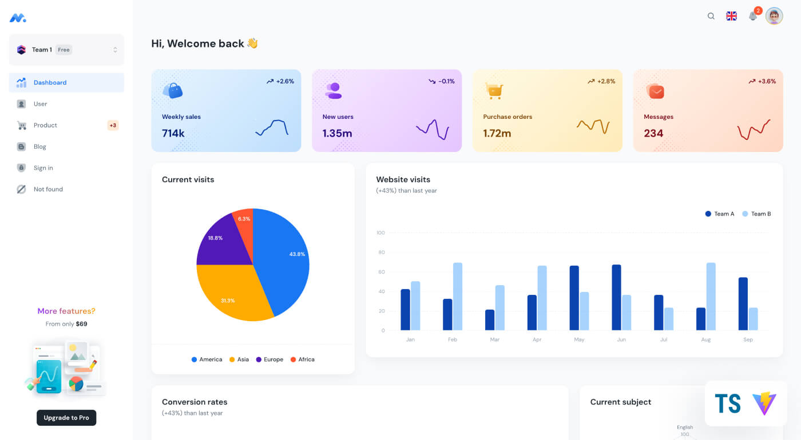

## UI KNOWLEDGE GRAPH QUERY

## Quick start

- Clone the repo: `https://github.com/JONNYDAN/UI_KG_STEM.git`
- Recommended: `Node.js v20.x`
- **Install:** `npm i` or `yarn install`
- **Start:** `npm run dev` or `yarn dev`
- **Build:** `npm run build` or `yarn build`
- Open browser: `http://localhost:3039`
